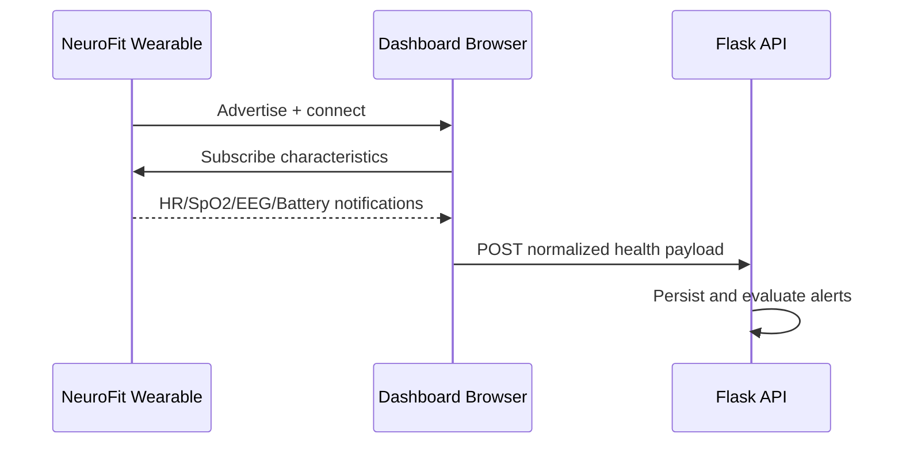

# BLE Communication

## GATT Profile (Firmware)

| Service/Characteristic | UUID | Direction | Payload |
|---|---|---|---|
| Health Service | `1810` | N/A | Parent service |
| Heart Rate | `2A37` | Notify/Read | `uint16` bpm |
| SpO2 | `2A5F` | Notify/Read | `uint16` percent |
| EEG Packet | `2A38` | Notify/Read | 20-byte packet |
| Battery | `2A19` | Notify/Read | `uint8` 0-100 |

## EEG Packet Layout

| Byte Index | Field |
|---|---|
| 0 | Dominant band enum (0..4) |
| 1 | Delta percentage |
| 2 | Theta percentage |
| 3 | Alpha percentage |
| 4 | Beta percentage |
| 5 | Gamma percentage |
| 6..19 | Reserved (currently zero-filled) |

## Browser BLE Path (Current)

Current frontend scripts use generic/standard service names (`heart_rate`, `health_data`, `measurement`) and in-page fallback logic. This does not fully match firmware UUIDs.

## Recommended Contract Alignment

1. Define a single UUID map source used by firmware docs and JS parser.
2. Implement parser per characteristic and packet schema versioning.
3. Add reconnect and characteristic subscription retry policy.

## BLE Data Flow Diagram

See [[Data Flow|Data-Flow]] for full pipeline behavior.
