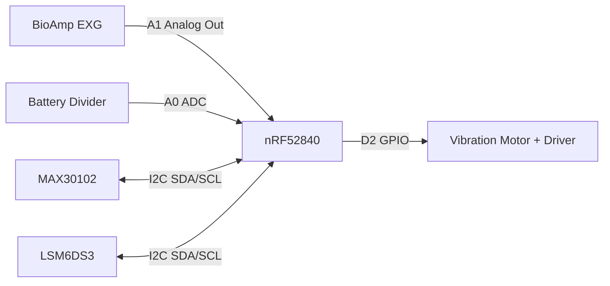

# Circuit Diagram

## Logical Wiring Diagram

## Wiring Table (Current/Target)

| Signal | MCU Pin | Connected Module | Status |
|---|---|---|---|
| EEG Analog | A1 | BioAmp EXG output | Implemented |
| Battery ADC | A0 | Battery divider output | Implemented |
| Haptic Control | D2 | Vibration motor driver input | Implemented |
| I2C SDA/SCL | Board default I2C pins | MAX30102 + LSM6DS3 | LSM6DS3 in code; MAX30102 integration pending |

## Electrical Recommendations

1. Add RC low-pass and proper shielding for EXG analog line.
2. Use dedicated transistor/MOSFET + flyback strategy for motor drive stability.
3. Verify battery divider resistor values to keep ADC input within safe range.

For exact pin references and firmware mapping, see [[Pinout|Pinout]].
