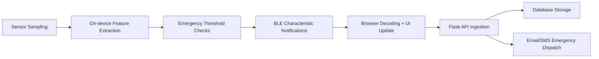
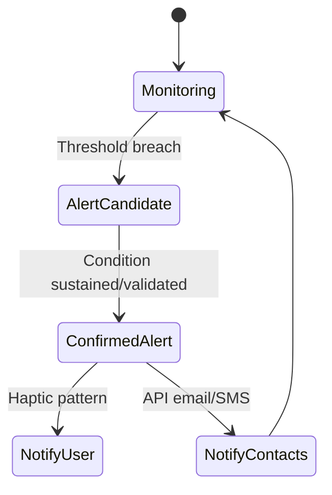

# Data Flow

## Pipeline Overview

## Operational Steps

1. Firmware samples analog EEG and motion data.
2. FFT converts raw EEG window into band percentages.
3. Firmware publishes HR/SpO2/EEG/battery via BLE notifications.
4. Browser dashboard receives characteristic events and updates metrics.
5. Backend API persists selected data and triggers emergency workflows.

## State Flow (Emergency Path)

## Data Integrity Considerations

- Add timestamps at source and at ingestion.
- Include sensor validity flags and confidence metrics.
- Store firmware and parser schema versions alongside records.

See [[Testing and Validation|Testing-and-Validation]] for verification strategy.
