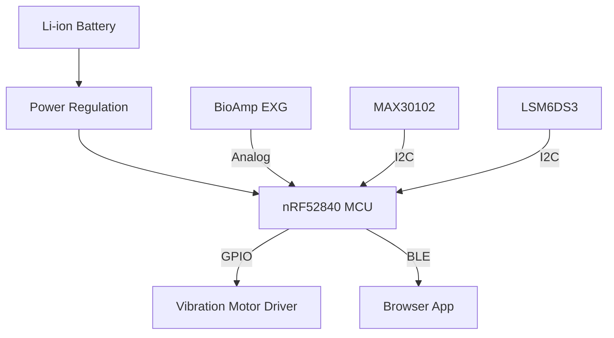

# Hardware Architecture

## Hardware Stack

| Component | Role | Current Status |
|---|---|---|
| Seeed XIAO nRF52840 | Main MCU, BLE radio, sensor orchestration | Implemented |
| BioAmp EXG Pill | Analog biosignal (EEG-like) acquisition | Implemented (A1 input path) |
| MAX30102 | Heart-rate + SpO2 | Planned/placeholder in firmware logic |
| LSM6DS3 IMU | Motion/fall detection | Implemented in firmware |
| Vibration Motor | Haptic alert output | Implemented (D2) |
| Battery monitor | State-of-charge estimate | Implemented (A0 ADC) |

## Hardware Topology

## Design Notes

- EEG processing is currently frequency-band oriented, not waveform-diagnostic.
- Motion/fall detection combines free-fall and orientation change checks.
- Battery mapping uses a simple linear approximation between 3.0 V and 3.7 V.

## Hardware Constraints

1. Analog front-end quality and electrode placement dominate EEG signal quality.
2. Motion artifacts can heavily contaminate EXG channels.
3. Battery percentage estimation is coarse without load/temperature compensation.

For connector-level details, see [[Pinout|Pinout]] and [[Circuit Diagram|Circuit-Diagram]].
