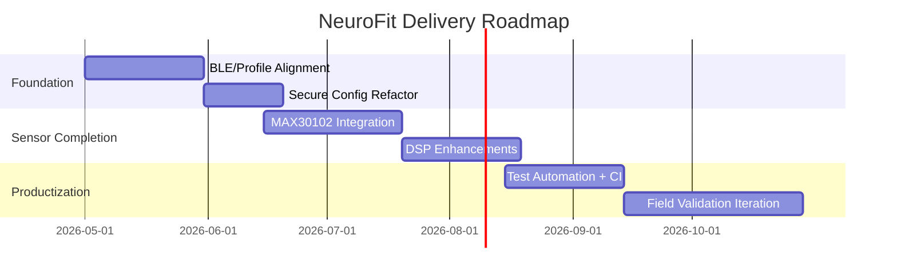

# Roadmap

## Near-Term (0-2 Months)

1. BLE contract unification (UUIDs, packet schema, parser).
2. Replace simulated HR/SpO2 path with MAX30102 integration.
3. Move all credentials/API keys to environment configuration.
4. Fix duplicate Flask run invocation and tighten runtime config.

## Mid-Term (2-6 Months)

1. Add robust filtering pipeline (notch + band-pass + artifact suppression).
2. Build historical analytics endpoints and complete health-data page scripts.
3. Introduce automated CI for linting, tests, and build checks.
4. Add telemetry schema versioning and migration strategy.

## Research / Advanced (6+ Months)

1. Personalized baseline modeling for stress and recovery indices.
2. Explainable mood-state inference model with confidence outputs.
3. Adaptive closed-loop meditation recommendations.
4. Human-subject protocol and comparative validation studies.

## Milestone Diagram

See [[Contributing|Contributing]] for how to participate.
