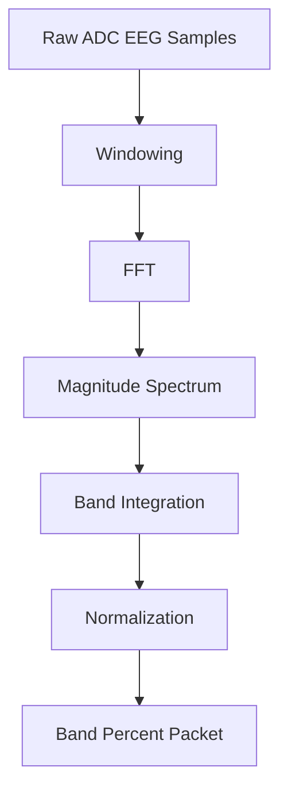

# Signal Processing

## EEG Feature Pipeline

Firmware implements frequency-domain feature extraction:

1. Acquire 128 samples at ~250 Hz.
2. Apply Hamming window.
3. Run FFT and convert complex bins to magnitudes.
4. Integrate spectral bins across canonical EEG bands.
5. Normalize by total power to obtain band percentages.

## Band Definitions

| Band | Frequency Range (Hz) |
|---|---|
| Delta | 0.5-4 |
| Theta | 4-8 |
| Alpha | 8-12 |
| Beta | 12-30 |
| Gamma | 30-100 |

## Example Processing Flow

## Current Limitations

| Limitation | Impact |
|---|---|
| No dedicated notch filter (50/60 Hz) | Mains interference sensitivity |
| Basic artifact detection threshold | False positives in motion-heavy sessions |
| No adaptive baseline normalization | Reduced cross-session comparability |

## Recommended Improvements

1. Add digital notch and band-pass filtering before FFT.
2. Add artifact rejection using accelerometer-informed gating.
3. Move from single-window estimates to rolling confidence metrics.

See [[Sensor Modules|Sensor-Modules]] and [[Safety Considerations|Safety-Considerations]].
