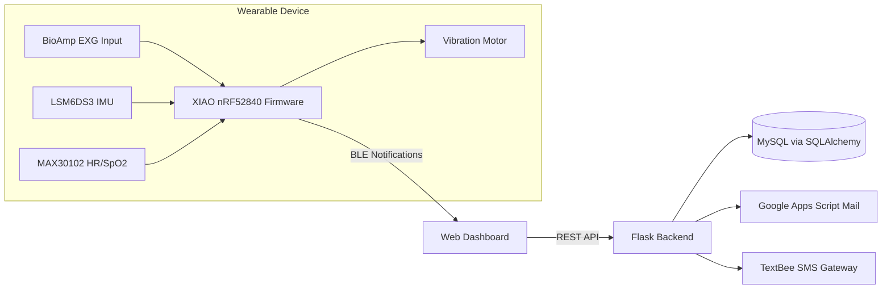

# System Architecture

## Architecture Summary

NeuroFit is organized as a three-layer system:

1. Wearable edge node (microcontroller + sensors + actuator)
2. Wireless transport (BLE GATT notifications)
3. Web platform (Flask backend + browser clients + alert gateways)

## End-to-End Block Diagram

## Functional Responsibilities

| Layer | Responsibilities |
|---|---|
| Firmware | Sampling, FFT feature extraction, threshold checks, BLE publication, haptic alerts |
| Browser | Device pairing, live rendering, meditation UX, location capture |
| Backend | Authentication, data ingestion APIs, persistence, emergency dispatch |

## Interface Boundaries

- BLE profile and payload schema between firmware and browser
- REST contracts between browser and Flask (`/api/*`)
- Alert payload contracts for email/SMS providers

## Known Integration Risks

| Risk | Impact | Mitigation |
|---|---|---|
| BLE UUID mismatch (firmware vs web code) | No/partial telemetry | Standardize UUID map and parser contract |
| Simulated sensor values in code paths | Invalid analytics | Replace placeholders with calibrated drivers |
| Hardcoded secrets | Security exposure | Move to environment variables + secret vault |

See [[BLE Communication|BLE-Communication]] and [[Roadmap|Roadmap]].
