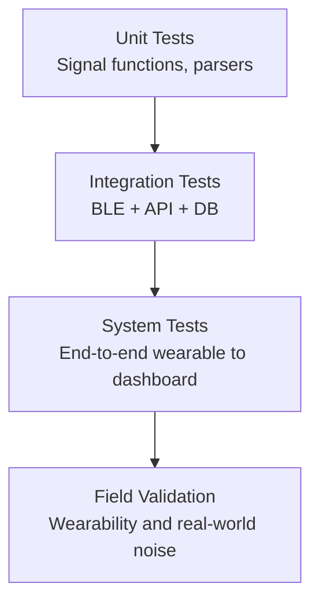

# Testing and Validation

## Validation Strategy

Testing should cover firmware correctness, BLE interoperability, backend behavior, and user-facing workflow safety.

## Test Pyramid

## Minimum Test Matrix

| Area | Test | Acceptance Criteria |
|---|---|---|
| EEG DSP | FFT band split with synthetic signals | Correct dominant band classification |
| BLE | Characteristic notification decode | Parser outputs expected fields and units |
| Emergency logic | HR/SpO2/fall threshold triggers | Correct haptic + API alert path |
| Backend auth | Login/signup/session transitions | Protected routes blocked when unauthenticated |
| Alert API | Email/SMS payload dispatch | Success/failure responses are explicit |

## Recommended Bench Setup

1. Signal generator for EEG channel simulation.
2. BLE sniffer/tooling for packet verification.
3. Current probe/power profiler for battery modeling.
4. Repeatable motion fixture for fall-detection validation.

## Biomedical Validation Notes

- Compare HR/SpO2 against reference pulse oximeter under controlled conditions.
- Evaluate EEG feature repeatability across sessions and users.
- Quantify false alert rates before enabling unattended alerting.

See [[Safety Considerations|Safety-Considerations]].
